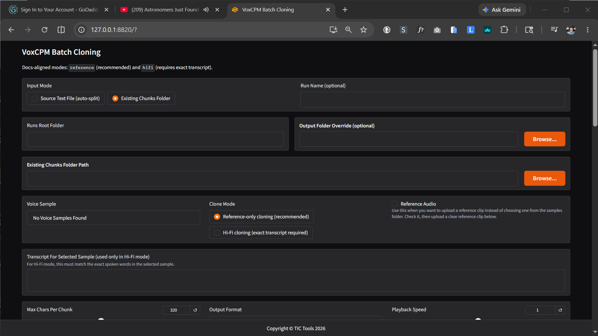

# VoxCPM Batch Cloning UI

Current release: `v1.0`



VoxCPM Batch Cloning UI is a Windows-first helper app for turning long scripts into cloned-voice audio with [VoxCPM2](https://github.com/OpenBMB/VoxCPM). It adds a friendly browser interface around a batch workflow so you can:

- generate one audio file per text chunk,
- use either a full source text file or your own hand-made chunk files,
- clone from a local voice sample or custom uploaded reference audio,
- preview a run before generating,
- and optionally stitch the finished chunk files into one master audio file.

This project is open source, free to use, and free to fork under the Apache-2.0 license.

## What It Needs

At minimum, you need:

- Windows 10 or Windows 11 for the included one-click launcher workflow.
- Python 3.10 or 3.11. VoxCPM currently supports Python 3.10 through 3.12, but this project was built and tested with Python 3.10.
- A working Python environment. Conda or Miniconda is recommended for easier setup.
- [VoxCPM](https://github.com/OpenBMB/VoxCPM), which provides the actual TTS model code.
- [PyTorch](https://pytorch.org/get-started/locally/) installed for your hardware.
- [FFmpeg](https://ffmpeg.org/download.html) on your system `PATH` if you want MP3/OGG/M4A output, playback-speed changes, or stitched files in non-WAV formats.
- Enough disk space for the VoxCPM2 model download and enough GPU memory for practical generation speed. CPU-only use may work but is usually much slower.

Helpful official links:

- VoxCPM project: [github.com/OpenBMB/VoxCPM](https://github.com/OpenBMB/VoxCPM)
- VoxCPM documentation: [voxcpm.readthedocs.io](https://voxcpm.readthedocs.io/en/latest/)
- VoxCPM2 model page: [huggingface.co/openbmb/VoxCPM2](https://huggingface.co/openbmb/VoxCPM2)
- PyTorch install selector: [pytorch.org/get-started/locally](https://pytorch.org/get-started/locally/)
- FFmpeg downloads: [ffmpeg.org/download.html](https://ffmpeg.org/download.html)
- Miniconda downloads: [anaconda.com/docs/getting-started/miniconda/install](https://www.anaconda.com/docs/getting-started/miniconda/install)

## Installation And Setup

These instructions describe the simplest Windows setup.

### 1. Install the supporting tools

Install:

1. [Git](https://git-scm.com/downloads) if you plan to clone repositories from GitHub.
2. [Miniconda](https://www.anaconda.com/docs/getting-started/miniconda/install) or Anaconda.
3. [FFmpeg](https://ffmpeg.org/download.html), then make sure the `ffmpeg` command works in a new terminal window.

### 2. Download this project

Clone the repository:

```powershell
git clone https://github.com/YOUR-USER/YOUR-REPO.git
cd YOUR-REPO
```

If you downloaded a ZIP instead, extract it and open a terminal in the extracted project folder.

### 3. Create the Python environment

Create and activate a dedicated environment:

```powershell
conda create -n voxcpm310 python=3.10 -y
conda activate voxcpm310
python -m pip install --upgrade pip
```

### 4. Install PyTorch for your machine

Use the official [PyTorch install selector](https://pytorch.org/get-started/locally/) and choose the command that matches your operating system, package manager, and CUDA version.

For NVIDIA GPU users, install a CUDA-enabled PyTorch build before the rest of the project dependencies. If you do not have an NVIDIA GPU, choose the CPU option from the PyTorch selector.

### 5. Install the Python packages for this project

From the project folder:

```powershell
pip install -r requirements.txt
```

The first time you run generation, VoxCPM will download the model weights automatically if they are not already cached.

### 6. Optional: use the live VoxCPM source repository instead of the packaged release

Most users do not need this step. The normal `requirements.txt` install uses the installed `voxcpm` package.

If you want edits inside a local VoxCPM source folder to be the code that actually runs, clone the official VoxCPM repository and install it in editable mode:

```powershell
git clone https://github.com/OpenBMB/VoxCPM.git
pip install -e .\VoxCPM
```

Plain-English version:

- `pip install voxcpm` means Python uses the packaged version installed into your environment.
- `pip install -e path\to\VoxCPM` means Python uses the source code in that folder directly, so changes there affect the running app immediately.

### 7. Prepare a voice sample

This public release does not include voice samples.

Before using the local sample dropdown, add your own clean reference clip to:

```text
samples\
```

Recommended sample guidance for this project:

- Use your own recording or audio you have permission to use.
- Use a clean recording with only the target voice, no music, no background noise, and no overlapping speakers.
- Aim for at least `20 seconds` of natural speech for a stronger beginner-friendly result.
- Supported local sample formats are `.wav`, `.mp3`, `.ogg`, and `.m4a`.
- If you want Hi-Fi mode to auto-fill a transcript, add a matching `.txt` file beside the audio file with the same base name, such as `my_voice.wav` and `my_voice.txt`.

The official VoxCPM guidance says a clean `5-second-plus` reference clip can work for cloning; this project recommends `20+ seconds` as a more conservative target for steadier results. The app can also use a one-off uploaded reference clip without placing anything in the `samples` folder.

If the `samples` folder is empty, the interface shows `No Voice Samples Found` in the dropdown until you add one.

### 8. Launch the interface

From an activated environment:

```powershell
python batch_clone_webui.py
```

Then open:

```text
http://127.0.0.1:8820
```

Windows users can also run:

```powershell
.\launch_batch_clone_ui.bat
```

To create a desktop shortcut:

```powershell
powershell -ExecutionPolicy Bypass -File .\install_desktop_launcher.ps1
```

After that, you can launch the UI from the desktop shortcut.

## Typical Workflow

### Option A: start with one full source file

Choose `Source Text File (auto-split)` when you have one long script and want the app to create chunk files for you.

The app will:

1. split the source text into ordered chunk files,
2. save them under the run folder,
3. generate one audio file per chunk,
4. and optionally stitch the finished files together.

### Option B: use your own chunk files

Choose `Existing Chunks Folder` when you already prepared the chunks yourself.

Recommended chunk rules:

- Use one `.txt` file per chunk.
- Keep names in the intended order, ideally with leading numbers such as `001_intro.txt`, `002_problem.txt`, `003_solution.txt`.
- The output audio file keeps the same base name as the source text file.
- The app sorts files naturally, so numbered names are the safest way to guarantee order.
- `Max Chars Per Chunk` is not used in this mode because you already made the chunks yourself.
- Shorter chunks usually give you better control and make bad takes easier to replace.

## Interface Guide

### Input And Run Settings

| Setting | What it does |
| --- | --- |
| `Input Mode` | Choose between one long source file that the app splits automatically, or a folder of chunk files you already created. |
| `Run Name (optional)` | Names the run folder. If left blank, the app creates a timestamped name automatically. |
| `Runs Root Folder` | The parent folder where run folders are created. A run folder can contain generated chunks, logs, and other run-specific files. |
| `Output Folder Override (optional)` | Sends generated audio somewhere other than the default audio folder inside the run folder. |
| `Existing Chunks Folder Path` | The folder containing your hand-made `.txt` chunks. Used only when `Existing Chunks Folder` is selected. |
| `Source Text File` | The single long text file to split automatically. Used only when `Source Text File (auto-split)` is selected. |

### Voice And Cloning Settings

| Setting | What it does |
| --- | --- |
| `Voice Sample` | Chooses one of the user-provided reference clips found in the `samples` folder. If the folder is empty, the dropdown shows `No Voice Samples Found`. |
| `Clone Mode` | `Reference-only cloning` is the recommended everyday mode. `Hi-Fi cloning` is the interface name for VoxCPM's Ultimate Cloning workflow and requires the exact transcript of the reference clip. |
| `Reference Audio` | Check this when you want to upload a one-off reference clip instead of choosing a file from the `samples` folder. |
| `Custom Reference Audio` | Your uploaded voice sample when using custom reference audio. |
| `Transcript For Custom Reference` | Required only in `Hi-Fi cloning` mode. It must match the spoken words in the uploaded reference clip exactly. |
| `Transcript For Selected Sample` | Used only in `Hi-Fi cloning` mode. It must match the spoken words in the selected local sample exactly. If a same-name `.txt` transcript exists beside the sample file, the app can auto-fill it. |

### Generation Settings

| Setting | What it does |
| --- | --- |
| `Max Chars Per Chunk` | Used only when auto-splitting a full source file. Lower values make more, shorter chunks; higher values make fewer, longer chunks. |
| `Output Format` | Chooses the generated file format: WAV, MP3, OGG, or M4A. |
| `Playback Speed` | Changes the saved audio speed after generation. `1.0` is normal speed. |
| `CFG` | Advanced model-strength setting passed to VoxCPM. Start with `2.0` unless you have a reason to experiment. |
| `Inference Steps` | Controls generation effort. Higher values are slower and may improve quality, but the gain can be small after a point. |

### Stitch Settings

| Setting | What it does |
| --- | --- |
| `Auto-Stitch After Generation` | When checked, the app automatically joins the generated chunk files after a successful run. |
| `Output File Name (optional)` | Names the stitched master file. If you leave the extension off, the selected output format is added automatically. |
| `Stitch Now` | Manually joins the generated files after a run. Useful when you did not enable auto-stitch earlier. |
| `Gap Between Chunks (ms)` | Adds silence between joined files in the stitched master track. |

### Buttons And Output Panels

| Control | What it does |
| --- | --- |
| `Apply Production Profile` | Restores the recommended practical defaults for normal production use. |
| `Plan (Dry Run)` | Checks the planned inputs and outputs without generating audio. Use this before a large run. |
| `Run Generation` | Starts the actual batch generation job. |
| `Summary` | Shows run status, timing, folders, file counts, and the exact command being used. |
| `Logs` | Shows the live model and generation output. |
| `Resolved Chunks Folder` | Shows the exact chunk folder the app is using. |
| `Resolved Output Folder` | Shows the exact output folder the app is using. |
| `Generated Audio Files` | Lists the created audio files after generation begins. |
| `Stitch Summary` | Shows the result of a stitch operation. |
| `Stitch Logs` | Shows detailed output from the stitch process. |

## Choosing Between Reference-Only And Hi-Fi Cloning

Use `Reference-only cloning` when:

- you want the most forgiving workflow,
- you are cloning timbre from a voice sample,
- and you do not need the model to continue directly from the original clip's exact delivery.

Use `Hi-Fi cloning` when:

- you want VoxCPM's Ultimate Cloning behavior,
- you have the exact spoken transcript of the reference clip,
- and you want the generated voice to follow the original clip more tightly.

If the transcript is wrong in Hi-Fi mode, quality can become worse rather than better.

## Troubleshooting

### `ffmpeg` is not found

Install FFmpeg and make sure the folder containing `ffmpeg.exe` is on your system `PATH`. Close and reopen the terminal after changing `PATH`.

### The first run takes a long time

The first generation may need to download the VoxCPM2 model files. Later runs are faster because the files are cached locally.

### The app uses the wrong VoxCPM code

If you cloned the official VoxCPM source repo and want that source folder to be the version that runs, install it with:

```powershell
pip install -e path\to\VoxCPM
```

Otherwise Python will use whichever installed `voxcpm` package is already in the active environment.

### Existing chunks ignore `Max Chars Per Chunk`

That is expected. The setting only applies when the app is doing the splitting for you from one source text file.

### Output quality is poor in Hi-Fi mode

Double-check that the transcript exactly matches the spoken words in the reference clip. If you are not sure, use `Reference-only cloning` instead.

## Repository Files

| File | Purpose |
| --- | --- |
| `batch_clone_webui.py` | Browser interface and orchestration layer. |
| `batch_ultimate_clone.py` | Batch generation script. |
| `concat_audio_chunks.py` | Joins chunk audio into one stitched file. |
| `samples/` | User-owned local voice samples. Actual audio is intentionally not included in the public repository. |
| `launch_batch_clone_ui.bat` | Windows launcher for the browser interface. |
| `install_desktop_launcher.ps1` | Creates a desktop shortcut on Windows. |
| `requirements.txt` | Python dependencies for installation. |
| `SUPPORT.md` | Support and donation information. |
| `LICENSE` | Apache-2.0 open-source license. |

## Open Source

This project is free and open source. You are welcome to fork it, adapt it, and build on it under the terms of the Apache-2.0 license.

## Support

See [SUPPORT.md](SUPPORT.md) for support and donation information.
